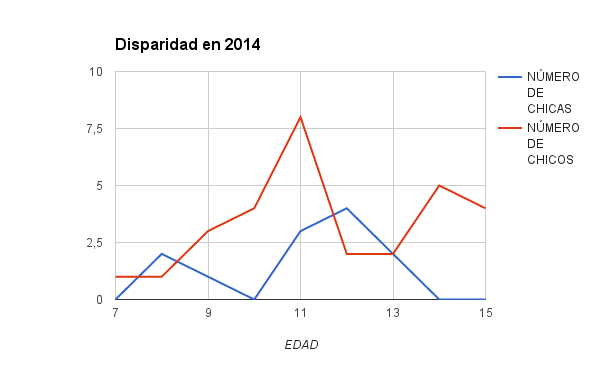
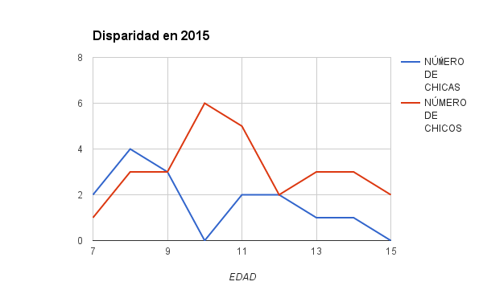

##Resumen

Desde el año 2010, la [Oficina de Software Libre](http://osl.ugr.es) viene organizando una serie de campus infantiles de software libre, donde se imparten conocimientos de ofimática y programación basados en Linux, el lenguaje de programación Scratch y paquetes ofimáticos libres. Desde el principio se ha notado disparidad de género dependiente de la edad, pero la proporción ha variado con los años. En este trabajo examinamos esa variación, tratando de buscar si hay una edad concreta en la que las chicas dejan de interesarse por la informática, lo que la convierte en una carrera poco atractiva para ellas, y si esa edad ha variado a lo largo de los años.


#Introducción

Desde prácticamente el inicio de la
[Oficina de Software Libre](http://osl.ugr.es) de la universidad de
Granada y con el objetivo principal de
[animar a los más pequeños a usar software libre de forma habitual y aumentar la alfabetización digital](http://www.opensourceworldconference.com/conferencia-virtual-2), a la vez que se ayuda a las familias de la Universidad de
Granada y, desde el año 2010, de fuera de la universidad a conciliar
su vida laboral con el cuidado de la familia, se han organizado estos
campus infantiles de software libre en el mes de julio, inicialmente
para 75 niños de 7 a 13 años, pero con ligeras variaciones a lo largo
de los años; algunos años se hicieron dos turnos, otros años se amplió
hasta 150 niños, en algunos casos se amplió hasta 14 o 15 años;
finalmente, en este año 2016, se ha quedado entre 7 y 13 años, aunque
hay algunas excepciones.

Algunas inscripciones las controla directamente la oficina, y de ellas
son de las que tenemos datos sobre edad; por lo tanto, de los años que
figuran en este trabajo, 2010 a 2016, el número de inscripciones varía
entre varias decenas y un centenar, y todas corresponden a
inscripciones de familias que no son personal de la universidad o no
tienen acceso a las subvenciones. Se trata, pues, de una *muestra* de
la población total por grupo de edades, pero es una muestra
significativa que incluye aproximadamente a la mitad de todos los
asistentes. En todo caso, del otro grupo de la UGR no se tenía
información de edad, sólo por grupos, por lo que se ha preferido
prescindir de esa información sin la precisión suficiente.

A lo largo de los años se ha ido encontrando una disparidad de género
clara por grupos de edad. Mientras que en los grupos de niños más
pequeños las chicas igualan o incluso superan a los chicos, según va
avanzando la edad las diferencias se van acentuando; también se van
acentuando las diferencias a lo largo de los años. Cabe notar que, en
este caso, son los padres los que eligen matricular a sus hijos en
esta actividad, aunque es cierto que, sobre todo dependiendo de la
edad, las niñas y niños expresarán su opinión sobre si quieren hacerla
o no y, sobre todo, si quieren volver en años sucesivos.

Sea como fuere, la disminución del número de chicas con la edad se
plasmará, más adelante, en un desinterés por las opciones más técnicas
de la ESO y Bachillerato y posteriormente en la elección de una
carrera relacionada con las TIC, llegando a los extremos actuales de
alrededor de un 10% de chicas en este tipo de carreras.


```{r, echo=FALSE}
library(ggplot2)
library(ggthemes)

data <- read.csv("grupos-de-edad.csv")

```

En este trabajo examinaremos, a continuación, tras un breve estado del arte, la distribución de chicas y chicos por campus y grupo de edad en la siguiente sección. A continuación veremos la evolución de la proporción de chicas en diferentes agrupaciones de edad a lo largo de los años, la tendencia si la hubiera y las medias y, finalmente, expondremos nuestras conclusiones.

#Estado del arte


La actitud aparentemente negativa de las chicas hacia las tecnologías de la información ha sido constatada en numerosas ocasiones. Siguiendo una completa revisión de la literatura en 2001, [@volman2001gender], el mismo autor en [@volman2005new] realizó una serie de encuestas realizadas en Estados Unidos entre profesores y alumnos de primaria y secundaria, se encontró que no sólo la actitud de las chicas era menos positiva, sino que también el tipo de tareas que realizaban en el ordenador eran diferentes. Un resultado similar, aunque para niños de edades algo superiores [@colley2003age], había *pequeñas* diferencias, pero que se han acentuado respecto a estudios hechos en décadas anteriores, durante los 90.


No se ha encontrado ningún trabajo que se circunscriba a nuestro país y examine cómo optan los jóvenes de enseñanza secundaria española por la tecnología, aunque sí se han encontrado algún estudio que la examina en el campo de los videojuegos [@escofet2007brecha]. Por eso es interesante este estudio, que examina opciones reales. 

#Distribución por edad

Como se ha indicado, las edades en las que se aceptan inscripciones en el campus va desde los 7 hasta los 13 y en ocasiones 14 y 15 años. En los siguientes gráficos se expone, del año 2010 al 2016, el número de chicas y chicos para cada edad. 


En estos dos primeros años se ve que, para las edades más tempranas, se da el caso de que haya más chicas que chicos. Incluso en 2011 hay más chicas de 12 años que chicos. 


El panorama cambia claramente este año, con más chicos que chicas en cualquier edad.





Todos estos años, del 2013 al 2015, hay algunas variaciones, pero en casi todos los grupos de edad salvo en los más pequeños y, ocasionalmente, para 12 años, hay más chicos que chicas en todas las edades. 


Finalmente, este mismo año, salvo para 7 años en el que hay 5 chicas y 2 chicos, en el resto de las edades la proporción de chicos es siempre mayor, hasta ser abrumadora para 11 o más años. 

A continuación examinaremos, por grupos de edades, cuál ha sido la evolución de esta proporción.

# Evolución de la proporción de chicas

```{r, echo=FALSE}
ggplot()+geom_line(data=data,aes(x=AÑO,y=as.numeric(X7.8),color="7-8"))+geom_line(data=data,aes(x=AÑO,y=as.numeric(X9.10),color="9-10"))+geom_line(data=data,aes(x=AÑO,y=as.numeric(X11.),color="11+"))+geom_point(data=data,aes(x=AÑO,y=as.numeric(X7.8),color="7-8"))+geom_point(data=data,aes(x=AÑO,y=as.numeric(X9.10),color="9-10"))+geom_point(data=data,aes(x=AÑO,y=as.numeric(X11.),color="11+"))+ylab("Porcentaje de chicas")+theme_tufte()
```

Agrupando por edades contiguas para que haya un número significativo de casos, en el gráfico anterior se muestra cuál es la evolución de la proporción de chicas en los campus del año 2010 al 2016. A continuación se muestra el resumen de los datos por edades.

```{r kable, echo=FALSE}
library(knitr)
data.guay <- data.frame(edad.hasta.8 = data$X7.8, de.9.a.10 = data$X9.10, de.11.en.adelante = data$X11.)
kable(summary(data.guay))
```

En esa tabla, que muestra el resumen de la *proporción de chicas* en el campus, se ve que la mediana medida a lo largo de los años va desde 50% para los más pequeños a 30% para los mayores, y la media de alrededor de 49% para los más pequeños a 38% para los mayores.

La gráfica muestra también, en el grupo de mayor edad, una estabilidad alrededor del 30% con tendencia decreciente, especialmente en el último año donde cae muy por debajo del 20%. Aunque hay pocos datos para establecer una correlación, en general hay una proporción bastante alta de chicas y chicos que vuelven en años sucesivos, pero en este caso no se ve que un año en el que haya una proporción alta de chicas en el grupo de edad más pequeño (por ejemplo, 2013) de lugar a una alta proporción de chicas en el año siguiente (2014), donde en realidad se dio el porcentaje de chicas más bajo para ese grupo de edad. 

En general se observa que el porcentaje de chicas disminuye con la edad, pero la caída resulta especialmente pronunciada a partir de los 11 años, con una disminución en el porcentaje de chicas de 11 puntos, bajando a menos de un tercio de la muestra. 

#Conclusiones

La principal observación es la constatación de que el interés de las
chicas, o de los padres, por los campus tecnológicos disminuye con la
edad, especialmente a partir de los 9 años de edad, pero de forma
mucho más pronunciada a partir de los 11 años. Desde el punto de vista
de la elección de carreras tecnológicas esto es preocupante porque las
chicas mostrarán poco interés por este tipo de carreras, optando por
bachillerato biosanitario o por la opción de humanidades, vaciando por
tanto los Bachilleratos que dan opción a carreras tecnológicas. De
hecho, también el número total de inscripciones en cada uno de los
grupos de edad varía, siendo los grupos hasta los 11 años los más
completos y disminuyendo el número de inscripciones totales en los más
mayores, como se puede observar también en las gráficas; es decir, el
interés por la tecnología disminuye *en general en toda la población*,
sólo que es más pronunciado en las chicas que en los chicos. 

Por esto, conviene que si se hace algún tipo de política dirigida a
aumentar el interés por la tecnología y el ingreso en las carreras
tecnológicas, hay que actuar a edades mucho más tempranas que las que
suelen ser habituales en este tipo de actuaciones, en chicas y chicos de los últimos años de
enseñanza secundaria y Bachillerato. Cualquier estrategia de
concienciación de los niños y familias hacia la tecnología debe
comenzar *en las últimas etapas de primaria*, es decir, 10 años y
primer curso de Enseñanza Secundaria Obligatoria, 11 años, antes de
que el interés por la tecnología disminuya y se pierda
definitivamente.

#Referencias

